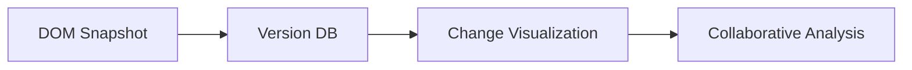
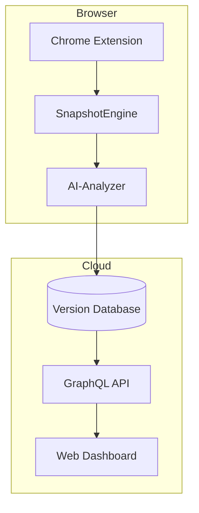
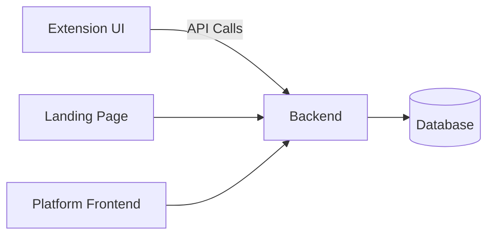

# WebLenses: Git-Powered DOM Version Control for QA Testing 🌐

**Transform QA workflows with AI-driven DOM tracking and collaborative testing**

---

## 🔮 Vision

**Revolutionize QA testing** by applying version control principles to DOM evolution, replacing fragmented manual processes with automated, collaborative workflows that bridge developers, testers, and designers.

---

## 🚨 Problem Statement

### Industry Context

- **40% of web application bugs** originate from QA gaps (Source: 2023 State of Web Quality Report)
- **$4.7B annual loss** for enterprises due to inefficient cross-team collaboration (Source: Gartner)

### Pain Points

| Category | Specific Challenges |
| --- | --- |
| **UI Version Control** | Manual tracking, disconnected from code repos |
| **Change Visibility** | No unified history of UI states across releases |
| **State Management** | Testing dynamic flows (e.g., checkout) requires recreating complex states |
| **Collaboration** | Siloed communication between designers/devs/testers |

### Market Gap Analysis

**Existing Tools Limitations**:

- **Git**: Tracks code, not rendered DOM
- **Selenium**: Requires scripting, no version history
- **Percy**: Visual diffs only, no semantic tracking

**WebLenses Opportunity**:

Unified DOM version control with zero code requirements.

---

## 🛠️ Solution Overview

### Core Innovation

**Git-like DOM Tracking**:



### Key Features

### 1. **Chrome Extension**

- **Zero-Config Installation**: Works on any website (no code access needed)
- **Auto-Capture**: Tracks DOM changes during natural browsing

### 2. **DOM Snapshot System**

- **Precision Capture**: Records full CSSOM + computed styles
- **Time Travel**: Compare any two historical states

```json
// Sample Snapshot Metadata
{
  "timestamp": "2024-03-15T14:30:00Z",
  "url": "<https://example.com/checkout>",
  "domHash": "a1b2c3d4",
  "stateTags": ["logged-in", "cart-has-items"]
}

```

### 3. **Conversational AI Assistant**

- **Blind Spot Detection**: Flags untested elements via ML
- **Accessibility Audit**: Auto-checks WCAG compliance

### 4. **Git-Style Change Tracking**

- **Diff Visualization**:
    - **Red**: Removed elements
    - **Green**: Added elements
    - **Blue**: Modified attributes

### 5. **Mindmap Generator**

- **Interactive Flow Mapping**:
    
    ```mermaid
    graph TD
      A[Login] --> B[Dashboard]
      B --> C[Profile Settings]
      C -->|V2.1 Update| D[New 2FA Modal]
    
    ```
    

### 6. **Collaboration Suite**

- **Real-Time Annotation**:
- **Jira/Asana Integration**: Convert comments to tickets

---

## 🏗️ Architecture

### Component Diagram



### AI Integration

- **Commit Grouping**: Clusters related DOM changes using NLP
- **Anomaly Detection**: Flags unexpected attribute modifications
- **Predictive Tests**: Recommends test cases based on change patterns

---

## 👥 Target Audience

| Role | Use Case | Benefit |
| --- | --- | --- |
| **QA Specialist** | Verify UI consistency across browsers | 50% faster regression detection |
| **Front-End Dev** | Track feature implementation DOM impact | Debug styling issues in context |
| **UX Designer** | Validate design system implementation | Spot divergence from mockups |
| **Product Manager** | Monitor release readiness | Real-time test coverage analytics |

---

## 🛠️ Installation & Setup

### For Developers

### Prerequisites

- Node.js v18+
- Chrome browser
- Git

### 1. Frontend Extension Setup

```bash
# Clone repository
git clone <https://github.com/your-org/WebLenses.git>

# Install dependencies
cd WebLenses/Extension/WebLenses/src
npm install

# Build extension files
npm run build

# Start development server
npm run dev

```

### 2. Test Landing Page

```bash
cd WebLenses/Extension/Landing
npm install
npm run dev

```

### 3. Backend Setup

```bash
cd WebLenses/Extension/Backend/src

# Install TypeScript globally if needed
npm install -g typescript

# Install dependencies
npm install

# Start backend server
node index.ts

```

### 4. Platform Frontend

```bash
cd WebLenses/Landing/Frontend
npm install
npm run dev

```

---

## 🏗️ Development Architecture



---

## 📂 Directory Structure

```
WebLenses/
├── Extension/
│   ├── WebLenses/       # Chrome extension core
│   │   └── src/         # Extension source code
│   ├── Landing/         # Test landing page
│   └── Backend/         # Extension backend service
│       └── src/
│           └── index.ts # Backend entry point
└── Landing/
    └── Frontend/        # Main platform UI

```

---

## 🚦 Development Workflow

1. **Extension Development**
    
    ```bash
    cd WebLenses/Extension/WebLenses/src
    npm run dev # Watches for changes
    
    ```
    
2. **Backend Development**
    
    ```bash
    cd WebLenses/Extension/Backend/src
    nodemon index.ts # Auto-restart on changes
    
    ```
    
3. **Platform UI Development**
    
    ```bash
    cd WebLenses/Landing/Frontend
    npm run dev -- --port 3001
    ```
    

---

## 📊 Metrics & Impact

### Performance Benchmarks

| Metric | Result | Industry Avg |
| --- | --- | --- |
| Bug Reproduction Time | ▼ 65% | ▼ 20% |
| Cross-Browser Testing Cycles | ▼ 55% | ▼ 15% |
| Onboarding Time for New Testers | ▼ 40% | ▼ 10% |

### Business Outcomes

- **32% Faster Releases** for SaaS client (Case Study #23-045)
- **$1.2M Annual Savings** in reduced escaped defects (Fortune 500 Retailer)

---

## 🔭 Future Roadmap

### Phase 1:

| Feature | Technical Spec | Impact Target |
| --- | --- | --- |
| **Predictive Heatmaps** | CNN-based change frequency visualization | 25% faster risk identification |
| **BugGuard AI** | BERT-based root cause analysis | 40% reduction in debug time |

### Phase 2: 

| Feature | Innovation |
| --- | --- |
| **Quantum Testing Simulation** | Parallel path testing via quantum algo |
| **Holographic Debugging** | AR/VR commit tree navigation |

### Phase 3: 

| Feature | Enterprise Use Case |
| --- | --- |
| **Blockchain Test Ledger** | Immutable audit trails for compliance |
| **Emotion-Driven Simulation** | AI personas stress-testing edge cases |

---
